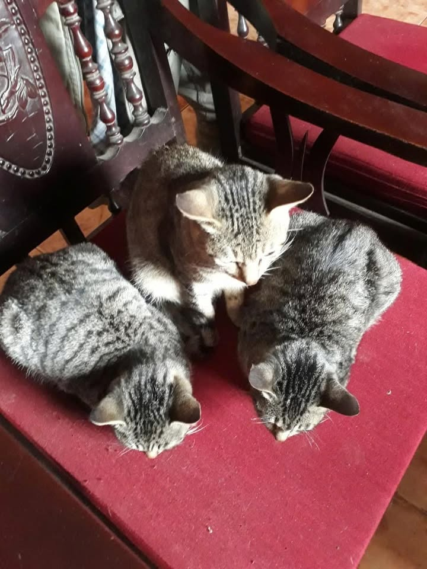

# 🎮 Quan’s Game Development Toolbox

Hi! I’m **Quan** 👋  
I like cats and I like making video games.

This repository is my **personal game dev toolbox** (mostly in godot for now):  
a growing collection of scripts, mechanics, systems, and experiments that I document along the way for **learning, reuse, and future projects**.

Think of it as:

> **Notes to my future self, but also public since I'm performative like that**

You’re welcome to explore, learn from/shit on, and use anything here (or you can just look my cats below...)

If you wanna get straight to work, consider checking out [**`Release Notes`**](release-notes.md) or [**`Project Structure`**](structure.md)

If it's your first time here, check out [_`User Guide`_](guide.md)

## 📄 License

All content in this repository is provided under the project’s license.  
Please read [`license.md`](license.md) for full details before using anything commercially or publicly.

---

## 🤝 Usage & Contributions

You’re free to:

- Fork the repository
- Use the code in personal or educational projects
- Modify and adapt systems to fit your needs

If you:

- Fix bugs
- Improve structure or readability
- Extend existing systems

A credit or mention would be greatly appreciated! But never required.

---

## 📬 Contact & Links

Want to collaborate, ask questions, or just chat about game dev (or cats) ?

You can reach me here:

- 📧 [_**Email**_](hmyam6090@gmail.com)
- 🐙 [_**GitHub**_](https://github.com/hmyam6090-lab)
- 🏢 [_**LinkedIn**_](https://www.linkedin.com/in/qu%C3%A2n-m-ho%C3%A0ng-251160383/)
